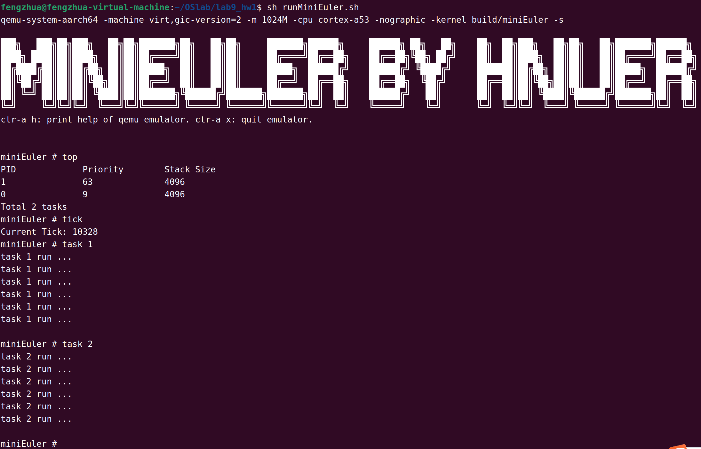

# miniEuler By HNUer

## 前言

目的是通过对一款商业内核UniProton的拆解、简化，并从0开始构建来了解操作系统中的关键技术和算法等。

最终构建操作系统如下，该系统支持：

- shell
- 时间Tick
- 任务创建
- 任务调度
- 任务延迟
- 信号量

## 各实验阶段

### Lab1 环境配置

- 安装交叉编译工具链 (aarch64)
- 安装QEMU模拟器
- 安装CMake
- 创建裸机(Bare Metal)程序
- 工程构建
- 将调试集成到vscode

#### 文件结构

**src：**放置所有源代码

**src/bsp：**存放与硬件紧密相关的代码

**src/include：**存放项目的大部分头文件

------

### Lab2 Hello，MiniEuler

实现一个可打印字符的函数（非系统调用），用于后续的调试和开发

#### Lab2_hw1

修改配置，不启用 fifo，通过检测 UARTFR 寄存器的 TXFE 位来发送数据。

------

### Lab4 异常处理

 这部分实验实现了部分异常的处理。

- 异常向量表
- 上下文保存与恢复
- 异常处理函数
- 系统调用实现

------

### Lab5 时钟Tick

 Arm采用的中断控制器叫做GIC，本实验选用GICv2版本。

- GICv2初始化
- 使能时钟中断

- 时钟中断处理
- 读取系统Tick值

### Lab6 任务调度

 UniProton实现的是一个单进程支持多线程的操作系统。在UniProton中，一个任务表示一个线程。UniProton中的任务为抢占式调度机制，而非时间片轮转调度方式。高优先级的任务可打断低优先级任务，低优先级任务必须在高优先级任务挂起或阻塞后才能得到调度。

#### Lab6_hw1

实现分时调度。这里我实现的是类似于多级反馈优先级队列的调度算法，当任务运行完时间片后就降一优先级，不过，还没有实现每隔一段时间就降任务提上最高优先级，预计未来继续开发来实现。

### Lab7 信号量与同步

实现信号量以及PV操作。

### Lab8 分页内存管理

对MMU（内存管理单元）进行配置后启用MMU。

### Lab9 Shell

实现本操作系统的Shell：

输入`tick`打印系统启动以来发生的时钟中断数

输入`top`打印当前系统在运行/就绪的线程PID，优先级，以及线程栈大小。

#### Lab6_hw1

输入`task`后可以创建并挂载并运行自定义的任务，支持参数1和2来运行不同任务。

最终效果如图：

未来还将支持更多Shell指令
